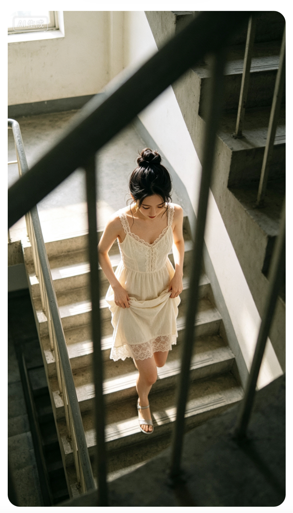
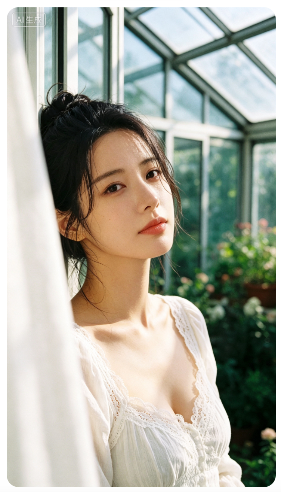
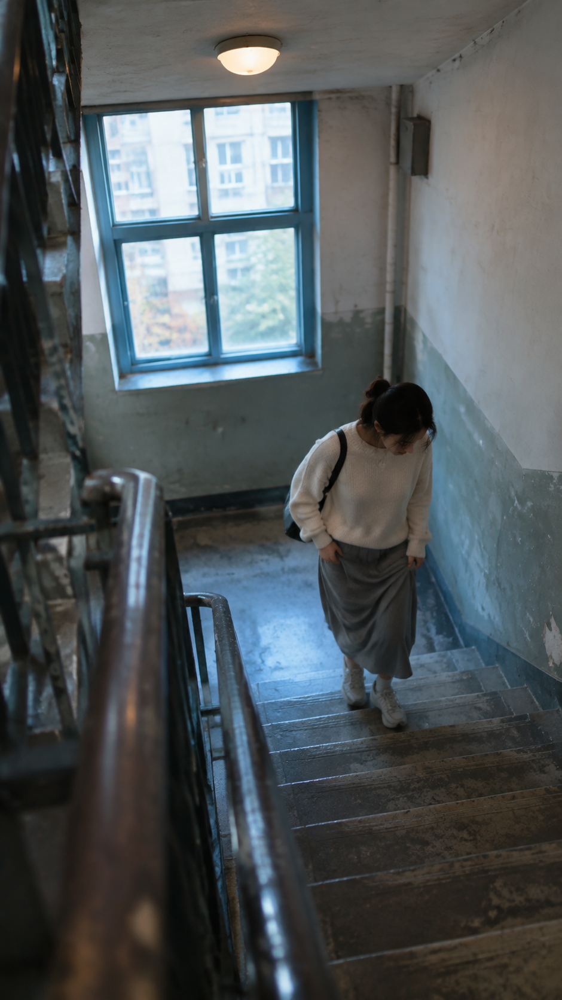
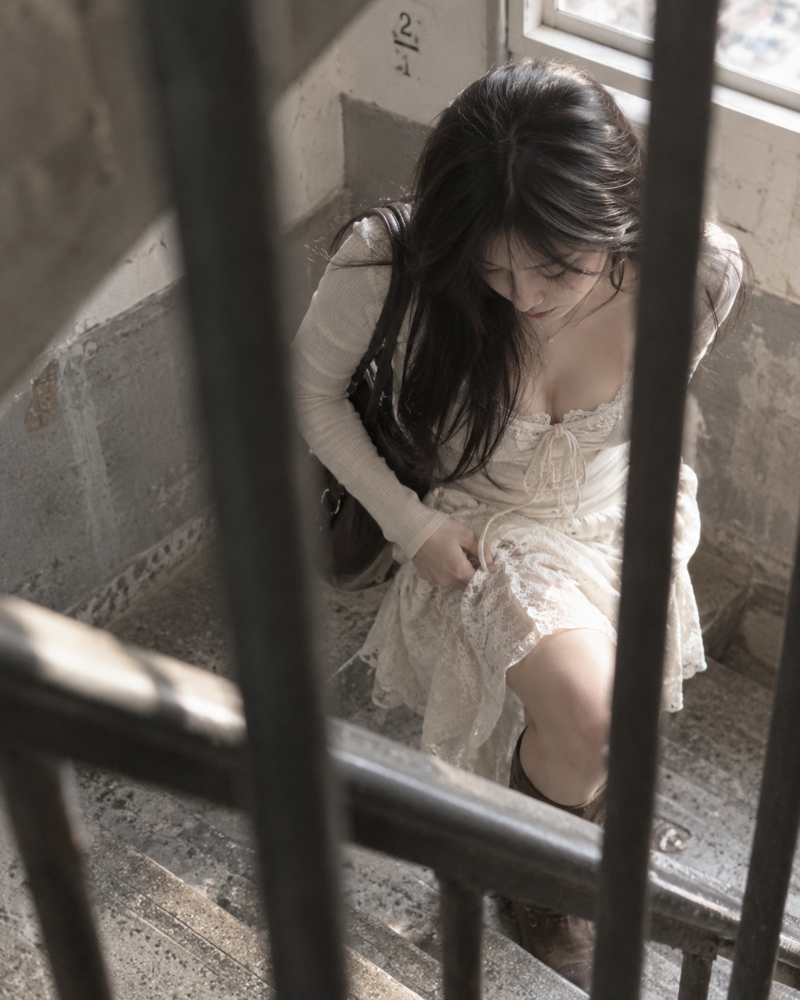
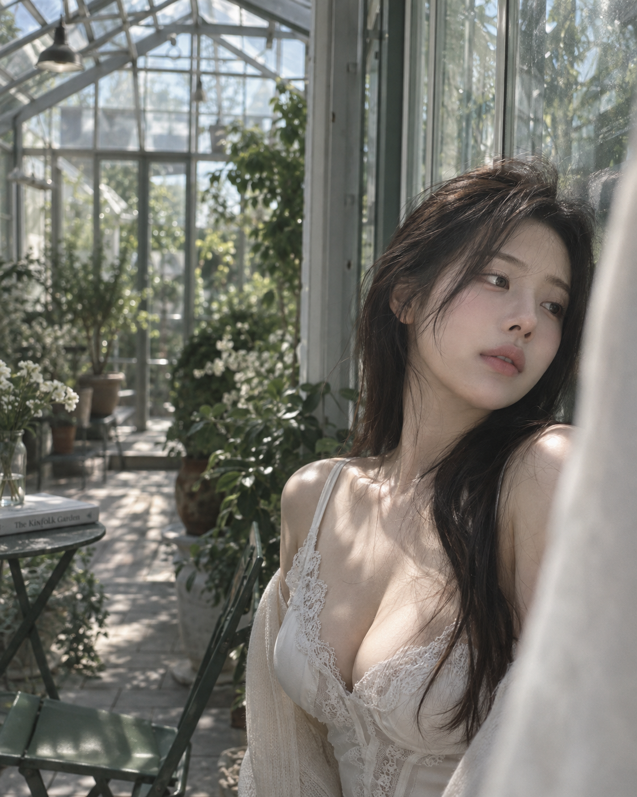
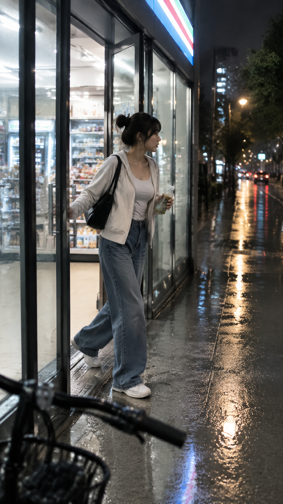
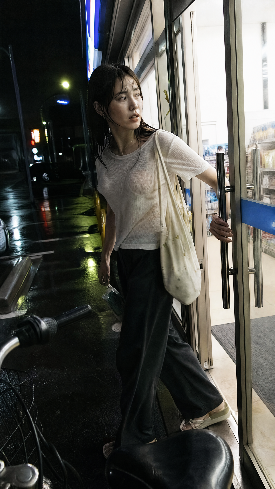

<p align="center">
  
</p>

# snap-skill

[中文](README.md) | English

> Teach AI to take a candid photo, not stage a portrait.

A multilingual candid photography skill that turns a short request into a natural-looking image prompt with believable action, camera placement, foreground occlusion, imperfect composition, and subtle photographic flaws.

Supported languages: Chinese, English, Japanese, Korean, Russian, French, and Spanish.

```text
$snap-skill A woman has just walked out of a convenience store after the rain, 9:16
```

State who and where; Snap Skill fills in the action, camera position, composition, lighting, and one to three subtle imperfections. Explicit user constraints always win. After returning a prompt, it can list the image-generation capabilities actually available in the current session and ask whether to generate now.

## Preview Gallery

<p align="center">
  
  
  
</p>
<p align="center">
  
  
  
</p>
<p align="center">
  
  
  
</p>

## Natural-language controls

```text
$snap-skill Make it more raw.
$snap-skill Keep this person, make the rest random.
$snap-skill Generate five prompt-only variations.
$snap-skill Make it feel like a phone snapshot.
```

Users may write in any supported language. Every result includes matching Chinese and English prompts generated from the same photography plan; there are no duplicated language-specific skills. Asking for prompt-only output suppresses the generation follow-up.

See [SKILL.md](SKILL.md) for the complete behavior.
